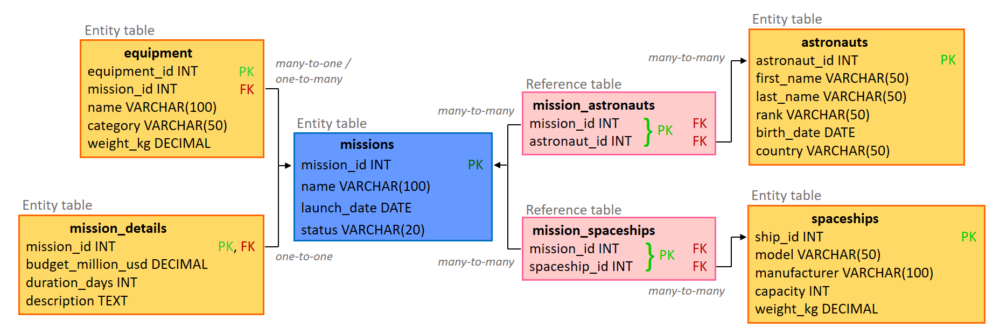

# Space Mission Control (Hibernate educational project)

## Overview

**Space Mission Control** is a console-based Java application designed to practice and demonstrate
working with **Hibernate ORM** using a clean layered architecture (**DAO + Service**).

The project focuses on:
- Object–Relational Mapping (ORM)
- Entity relationships (One-to-One, One-to-Many, Many-to-Many)
- Transaction management
- Lazy vs eager loading
- Criteria API and HQL
- Data validation and consistency
- Clean separation of responsibilities

No controllers or web framework are used at this stage — all logic is executed via a `Main` class.

## Technology Stack

- **Java 17+**
- **Hibernate ORM 6**
- **PostgreSQL**
- **JPA / Jakarta Persistence**
- **Bean Validation (Hibernate Validator)**
- **Maven**
- **IntelliJ IDEA**

## Architecture

The project follows a classic layered architecture: PostgreSQL -- DAO -- Service -- Main class

### Layers responsibility

| Layer | Responsibility |
|-----|---------------|
DAO | Database access, queries (HQL, Criteria API) |
Service | Business logic, validation, transactions |
Entity | Domain model and mappings |
Main | Application entry point |

Session and transaction management are handled in the **service layer**.

## Domain Model

The system models space missions and related entities:

### Entities

- **Mission**
- **MissionDetails**
- **Astronaut**
- **Spaceship**
- **Equipment**

### Entity Relationships

| Relationship | Type |
|------------|------|
Mission ↔ MissionDetails | One-to-One |
Mission ↔ Equipment | One-to-Many |
Mission ↔ Astronaut | Many-to-Many |
Mission ↔ Spaceship | Many-to-Many |

## Database structure

  
   
  <em>Figure 1: Database structure</em>

## Implemented Features

- CRUD operations for all entities
- Search by arbitrary fields (Criteria API)
- Case-insensitive search
- Partial string matching (`LIKE`)
- Search by relationships (e.g. all astronauts in a mission)
- Lazy loading with explicit fetch strategies
- Duplicate prevention before insert
- Validation using Bean Validation annotations
- Proper transaction handling
- Bidirectional relationship management

## Project Goals

This project is intended for:
- Learning Hibernate deeply (without Spring)
- Understanding ORM internals
- Practicing clean architecture
- Preparing for enterprise Java development
